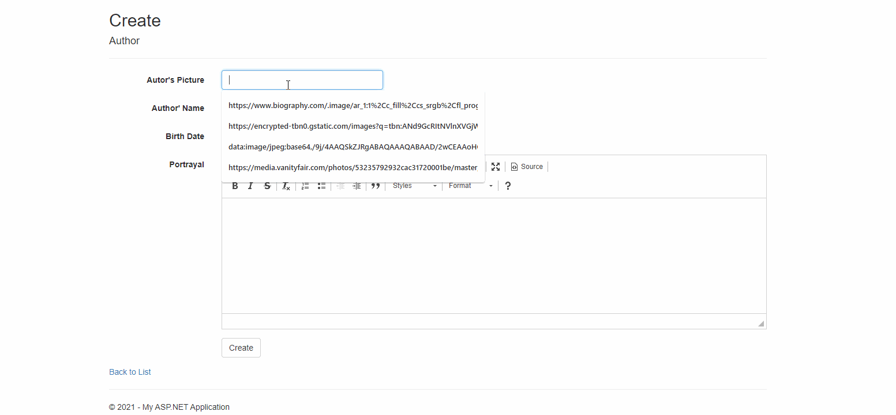

# Owls Book Store Conformation show

# Overview
  Organizing author list and their book series list. The author has their all series book lists and each book series also contains their's book lists and detailed information.
  Users can easily find the author and their book list orderly.
  
# Purpose
  I want to study Asp.net with this project.  
  I understand MVC model and Entity Framework.  
  I can handle data: create, edit, delete data with several related data table.  
  I can create front page view with Razor. 
  
 # Funtionalities :
 &nbsp; 1. List of Author : Be able to see the Author list with their simple information.  
 &nbsp; 2. Create, Edit, Delete, Detail of Author : Create Author and display author with their detailed information, edit and delete author from DB.  
 &nbsp; 3. List of Book Series : Display book series list with author name and simple information  
 &nbsp; 4. Add Book Seriese to the Author, Edit,Delete,Detail of Book Series : Be able to add book series to the author and edit, delete book series.  
 &nbsp; 5. List of Book list of series : Display each book list of book series. Title of book series has several book lists.  
 &nbsp; 6. Add, Edit, Delete, Details of book list of book series : Modify book list of book series.
 
 # Tool and language : 
  &nbsp; Visual studio 2019, Razor, c#
  
  
 
